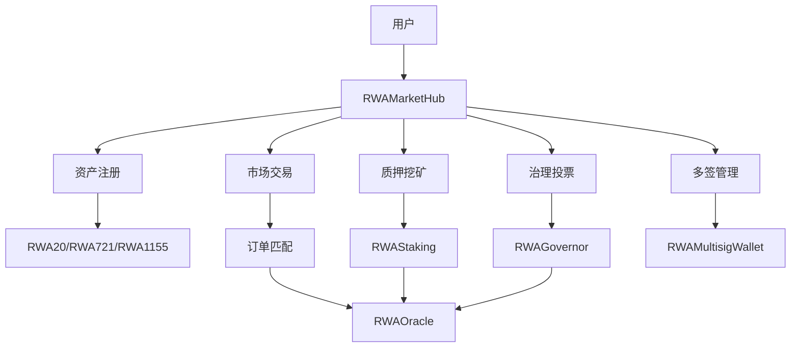

# PP-RWA 系统架构文档

## 概述

PP-RWA 是一个基于区块链技术的现实世界资产（RWA）代币化与交易平台，采用模块化、可扩展的架构设计，提供完整的DeFi生态服务。

## 整体架构

```
┌─────────────────────────────────────────────────────────────────┐
│                         PP-RWA 生态系统                          │
├─────────────────────────────────────────────────────────────────┤
│  前端层 (Frontend Layer)                                         │
│  ┌─────────────────┐ ┌─────────────────┐ ┌─────────────────┐      │
│  │   用户界面       │ │   移动端应用     │ │   管理后台       │      │
│  │  (Next.js)      │ │  (React Native) │ │  (Admin Panel)  │      │
│  └─────────────────┘ └─────────────────┘ └─────────────────┘      │
├─────────────────────────────────────────────────────────────────┤
│  应用层 (Application Layer)                                      │
│  ┌─────────────────┐ ┌─────────────────┐ ┌─────────────────┐      │
│  │  API网关         │ │  GraphQL服务    │ │  WebSocket服务   │      │
│  │  (Rate Limit)   │ │  (Query/Mutation)│ │  (Real-time)    │      │
│  └─────────────────┘ └─────────────────┘ └─────────────────┘      │
├─────────────────────────────────────────────────────────────────┤
│  业务层 (Business Layer)                                        │
│  ┌─────────────────┐ ┌─────────────────┐ ┌─────────────────┐      │
│  │  市场服务        │ │  资产管理服务    │ │  治理服务        │      │
│  │  (Trading)      │ │ (Asset Mgmt)    │ │ (Governance)     │      │
│  └─────────────────┘ └─────────────────┘ └─────────────────┘      │
│  ┌─────────────────┐ ┌─────────────────┐ ┌─────────────────┐      │
│  │  质押服务        │ │  分析服务        │ │  风控服务        │      │
│  │  (Staking)      │ │ (Analytics)     │ │ (Risk Mgmt)     │      │
│  └─────────────────┘ └─────────────────┘ └─────────────────┘      │
├─────────────────────────────────────────────────────────────────┤
│  数据层 (Data Layer)                                            │
│  ┌─────────────────┐ ┌─────────────────┐ ┌─────────────────┐      │
│  │  关系数据库       │ │  时序数据库      │ │  文档数据库      │      │
│  │  (PostgreSQL)   │ │ (InfluxDB)      │ │  (MongoDB)      │      │
│  └─────────────────┘ └─────────────────┘ └─────────────────┘      │
│  ┌─────────────────┐ ┌─────────────────┐ ┌─────────────────┐      │
│  │  缓存数据库       │ │  搜索引擎        │ │  区块链索引      │      │
│  │  (Redis)        │ │ (Elasticsearch)  │ │  (The Graph)    │      │
│  └─────────────────┘ └─────────────────┘ └─────────────────┘      │
├─────────────────────────────────────────────────────────────────┤
│  区块链层 (Blockchain Layer)                                    │
│  ┌─────────────────┐ ┌─────────────────┐ ┌─────────────────┐      │
│  │  智能合约        │ │  预言机网络      │ │  多链桥接        │      │
│  │  (Solidity)     │ │ (Chainlink)     │ │  (LayerZero)    │      │
│  └─────────────────┘ └─────────────────┘ └─────────────────┘      │
│  ┌─────────────────┐ ┌─────────────────┐ ┌─────────────────┐      │
│  │  以太坊主网      │ │  Layer2网络     │ │  侧链网络        │      │
│  │  (Ethereum)     │ │ (Polygon/ARB)   │ │  (BSC/Fantom)   │      │
│  └─────────────────┘ └─────────────────┘ └─────────────────┘      │
├─────────────────────────────────────────────────────────────────┤
│  基础设施层 (Infrastructure Layer)                              │
│  ┌─────────────────┐ ┌─────────────────┐ ┌─────────────────┐      │
│  │  云服务提供商    │ │  CDN服务        │ │  监控告警        │      │
│  │  (AWS/GCP)      │ │ (Cloudflare)    │ │ (Prometheus)    │      │
│  └─────────────────┘ └─────────────────┘ └─────────────────┘      │
│  ┌─────────────────┐ ┌─────────────────┐ ┌─────────────────┐      │
│  │  IPFS网络        │ │  消息队列        │ │  日志收集        │      │
│  │  (IPFS Cluster) │ │ (RabbitMQ)      │ │ (ELK Stack)     │      │
│  └─────────────────┘ └─────────────────┘ └─────────────────┘      │
└─────────────────────────────────────────────────────────────────┘
```

## 核心组件

### 1. 前端架构

#### 技术栈
- **框架**: Next.js 15 + React 19 + TypeScript
- **状态管理**: React Query + Zustand
- **Web3集成**: RainbowKit + wagmi + viem
- **UI组件**: shadcn/ui + TailwindCSS v4
- **样式系统**: TailwindCSS + PostCSS
- **图表库**: Recharts + D3.js

#### 组件架构
```
src/
├── app/                    # Next.js App Router
│   ├── page.tsx           # 主页面
│   ├── layout.tsx         # 根布局
│   └── globals.css        # 全局样式
├── components/            # 可复用组件
│   ├── ui/               # 基础UI组件
│   ├── rwa-market/       # RWA市场组件
│   ├── layout/           # 布局组件
│   └── common/           # 通用组件
├── lib/                  # 工具库
│   ├── utils.ts          # 通用工具函数
│   ├── wagmi.ts          # Web3配置
│   └── constants.ts      # 常量定义
├── hooks/                # 自定义Hooks
├── services/             # API服务
└── types/                # TypeScript类型定义
```

### 2. 智能合约架构

#### 合约组织
```
src/
├── RWAMarketHub.sol       # 市场中心合约
├── assets/               # 资产代币合约
│   ├── RWA20.sol         # ERC-20代币合约
│   ├── RWA721.sol        # ERC-721 NFT合约
│   └── RWA1155.sol       # ERC-1155多代币合约
├── defi/                 # DeFi功能合约
│   ├── RWAStaking.sol    # 质押合约
│   ├── RWAGovernor.sol   # 治理合约
│   └── RWAMultisigWallet.sol # 多签钱包
├── infrastructure/       # 基础设施合约
│   ├── RWAOracle.sol     # 预言机合约
│   └── RWAUpgradeableProxy.sol # 代理合约
├── libraries/            # 合约库
│   ├── LibRWA.sol        # RWA工具库
│   └── LibMath.sol       # 数学工具库
└── interfaces/           # 接口定义
    ├── IRWAMarket.sol    # 市场接口
    └── IRWAAsset.sol     # 资产接口
```

#### 合约交互流程


### 3. 后端服务架构

#### 微服务设计
```
services/
├── api-gateway/          # API网关服务
├── market-service/       # 市场服务
├── asset-service/        # 资产管理服务
├── staking-service/      # 质押服务
├── governance-service/   # 治理服务
├── analytics-service/    # 分析服务
├── risk-service/         # 风控服务
├── notification-service/ # 通知服务
└── indexer-service/      # 索引服务
```

#### 数据流架构
```
┌─────────────────┐    ┌─────────────────┐    ┌─────────────────┐
│   前端应用       │───▶│   API网关        │───▶│   业务服务       │
└─────────────────┘    └─────────────────┘    └─────────────────┘
                                 │                       │
                                 ▼                       ▼
                        ┌─────────────────┐    ┌─────────────────┐
                        │   认证授权       │    │   数据缓存       │
                        └─────────────────┘    └─────────────────┘
                                 │                       │
                                 ▼                       ▼
                        ┌─────────────────┐    ┌─────────────────┐
                        │   负载均衡       │    │   数据库集群     │
                        └─────────────────┘    └─────────────────┘
```

## 数据模型

### 核心实体

#### 资产实体 (Asset)
```typescript
interface Asset {
  id: string
  name: string
  symbol: string
  type: 'ERC20' | 'ERC721' | 'ERC1155'
  contractAddress: string
  totalSupply: string
  assetValue: string
  apy: number
  metadata: AssetMetadata
  isActive: boolean
  createdAt: string
  creator: string
}

interface AssetMetadata {
  description: string
  category: string
  location?: string
  legalDocuments: string[]
  valuationReports: string[]
  insuranceInfo?: string
}
```

#### 交易实体 (Transaction)
```typescript
interface Transaction {
  id: string
  from: string
  to: string
  assetAddress: string
  amount: string
  price: string
  type: 'buy' | 'sell' | 'transfer'
  status: 'pending' | 'completed' | 'failed'
  timestamp: string
  blockNumber: number
  txHash: string
  gasUsed: string
}
```

#### 质押实体 (StakingPosition)
```typescript
interface StakingPosition {
  id: string
  userId: string
  poolId: string
  assetAddress: string
  amount: string
  rewards: string
  lockPeriod: number
  startTime: string
  endTime: string
  isActive: boolean
  autoCompound: boolean
}
```

#### 治理实体 (GovernanceProposal)
```typescript
interface GovernanceProposal {
  id: string
  title: string
  description: string
  proposer: string
  targets: string[]
  values: string[]
  calldatas: string[]
  status: 'active' | 'pending' | 'executed' | 'rejected'
  votesFor: string
  votesAgainst: string
  quorum: string
  startTime: string
  endTime: string
  executionTime?: string
}
```

### 数据库设计

#### PostgreSQL 关系表
```sql
-- 资产表
CREATE TABLE assets (
  id VARCHAR(255) PRIMARY KEY,
  name VARCHAR(255) NOT NULL,
  symbol VARCHAR(50) NOT NULL,
  type VARCHAR(20) NOT NULL,
  contract_address VARCHAR(255) NOT NULL,
  total_supply DECIMAL(78, 0) NOT NULL,
  asset_value DECIMAL(78, 0) NOT NULL,
  apy DECIMAL(5, 2),
  metadata JSONB,
  is_active BOOLEAN DEFAULT true,
  created_at TIMESTAMP DEFAULT CURRENT_TIMESTAMP,
  creator VARCHAR(255) NOT NULL
);

-- 交易表
CREATE TABLE transactions (
  id VARCHAR(255) PRIMARY KEY,
  from_address VARCHAR(255) NOT NULL,
  to_address VARCHAR(255) NOT NULL,
  asset_address VARCHAR(255) NOT NULL,
  amount DECIMAL(78, 0) NOT NULL,
  price DECIMAL(78, 0),
  type VARCHAR(20) NOT NULL,
  status VARCHAR(20) DEFAULT 'pending',
  timestamp TIMESTAMP DEFAULT CURRENT_TIMESTAMP,
  block_number BIGINT,
  tx_hash VARCHAR(255) NOT NULL,
  gas_used DECIMAL(20, 0)
);

-- 用户表
CREATE TABLE users (
  address VARCHAR(255) PRIMARY KEY,
  email VARCHAR(255),
  nickname VARCHAR(100),
  avatar_url VARCHAR(500),
  reputation_score INTEGER DEFAULT 0,
  is_kyc_verified BOOLEAN DEFAULT false,
  created_at TIMESTAMP DEFAULT CURRENT_TIMESTAMP,
  last_login TIMESTAMP
);
```

## 安全架构

### 多层安全防护

#### 1. 智能合约层安全
- **多重签名**: 关键操作需要多方确认
- **时间锁**: 重要操作设置延迟执行
- **权限控制**: 基于角色的访问控制
- **重入保护**: 防范重入攻击
- **溢出检查**: 防止数值溢出
- **暂停机制**: 紧急情况下的安全保护

#### 2. 应用层安全
- **身份认证**: JWT + OAuth 2.0
- **授权管理**: RBAC权限模型
- **API限流**: 防止DDoS攻击
- **输入验证**: 严格的参数校验
- **SQL注入防护**: 参数化查询
- **XSS防护**: 输出编码

#### 3. 网络层安全
- **HTTPS**: 强制SSL/TLS加密
- **防火墙**: 网络访问控制
- **DDoS防护**: Cloudflare保护
- **VPN接入**: 内网访问控制

#### 4. 数据层安全
- **数据加密**: 敏感数据加密存储
- **备份策略**: 定期自动备份
- **访问日志**: 完整的操作审计
- **权限分离**: 读写分离

### 合规设计

#### 1. KYC/AML集成
```typescript
interface KYCProvider {
  verifyUser(userIdentity: UserIdentity): Promise<KYCResult>
  checkAML(address: string): Promise<AMLResult>
  updateRiskScore(userId: string, score: number): Promise<void>
}
```

#### 2. 地域限制
```typescript
interface ComplianceService {
  checkUserJurisdiction(userIP: string): Promise<Jurisdiction>
  isAssetAvailableInRegion(assetId: string, region: string): Promise<boolean>
  enforceRestrictions(user: User, operation: Operation): Promise<boolean>
}
```

## 性能优化

### 1. 前端优化
- **代码分割**: 动态导入和懒加载
- **缓存策略**: 浏览器缓存 + CDN
- **图片优化**: WebP格式 + 响应式图片
- **Bundle优化**: Tree shaking + 压缩

### 2. 后端优化
- **数据库优化**: 索引优化 + 查询优化
- **缓存策略**: Redis多级缓存
- **连接池**: 数据库连接复用
- **异步处理**: 消息队列解耦

### 3. 区块链优化
- **Gas优化**: 交易批处理
- **Layer2集成**: Polygon/Arbitrum支持
- **状态通道**: 高频交易优化
- **预言机优化**: 价格数据聚合

## 监控与运维

### 1. 系统监控
```typescript
interface MonitoringMetrics {
  systemHealth: {
    cpu: number
    memory: number
    disk: number
    network: number
  }
  applicationMetrics: {
    requestRate: number
    errorRate: number
    responseTime: number
    activeUsers: number
  }
  blockchainMetrics: {
    gasPrice: number
    blockTime: number
    networkStatus: string
  }
}
```

### 2. 告警系统
- **阈值告警**: 指标超过阈值触发
- **异常检测**: AI驱动的异常识别
- **多渠道通知**: 邮件、短信、钉钉
- **升级机制**: 告警升级和抑制

### 3. 日志管理
```typescript
interface LogEntry {
  timestamp: string
  level: 'DEBUG' | 'INFO' | 'WARN' | 'ERROR'
  service: string
  message: string
  metadata: Record<string, any>
  traceId?: string
  userId?: string
}
```

## 部署架构

### 1. 容器化部署
```dockerfile
# 前端Dockerfile
FROM node:18-alpine
WORKDIR /app
COPY package*.json ./
RUN npm ci --only=production
COPY . .
RUN npm run build
EXPOSE 3000
CMD ["npm", "start"]
```

### 2. Kubernetes部署
```yaml
apiVersion: apps/v1
kind: Deployment
metadata:
  name: pp-rwa-frontend
spec:
  replicas: 3
  selector:
    matchLabels:
      app: pp-rwa-frontend
  template:
    metadata:
      labels:
        app: pp-rwa-frontend
    spec:
      containers:
      - name: frontend
        image: pp-rwa/frontend:latest
        ports:
        - containerPort: 3000
```

### 3. CI/CD流水线
```yaml
# GitHub Actions
name: CI/CD Pipeline
on:
  push:
    branches: [main, develop]

jobs:
  test:
    runs-on: ubuntu-latest
    steps:
      - uses: actions/checkout@v3
      - name: Run tests
        run: npm run test

  deploy:
    needs: test
    runs-on: ubuntu-latest
    steps:
      - name: Deploy to production
        run: kubectl apply -f k8s/
```

## 扩展性设计

### 1. 水平扩展
- **无状态服务**: 微服务架构支持水平扩展
- **负载均衡**: 多实例负载分发
- **数据库分片**: 数据水平分片
- **缓存集群**: Redis集群部署

### 2. 功能扩展
- **插件系统**: 支持第三方插件
- **API版本化**: 向后兼容的API设计
- **模块化架构**: 功能模块独立部署
- **多链支持**: 新区块链网络接入

### 3. 地域扩展
- **多地域部署**: 全球化部署策略
- **CDN加速**: 就近访问优化
- **数据同步**: 跨地域数据同步
- **本地化支持**: 多语言多货币

---

本架构文档将随着项目的发展持续更新，确保架构设计能够满足业务需求和技术发展的要求。